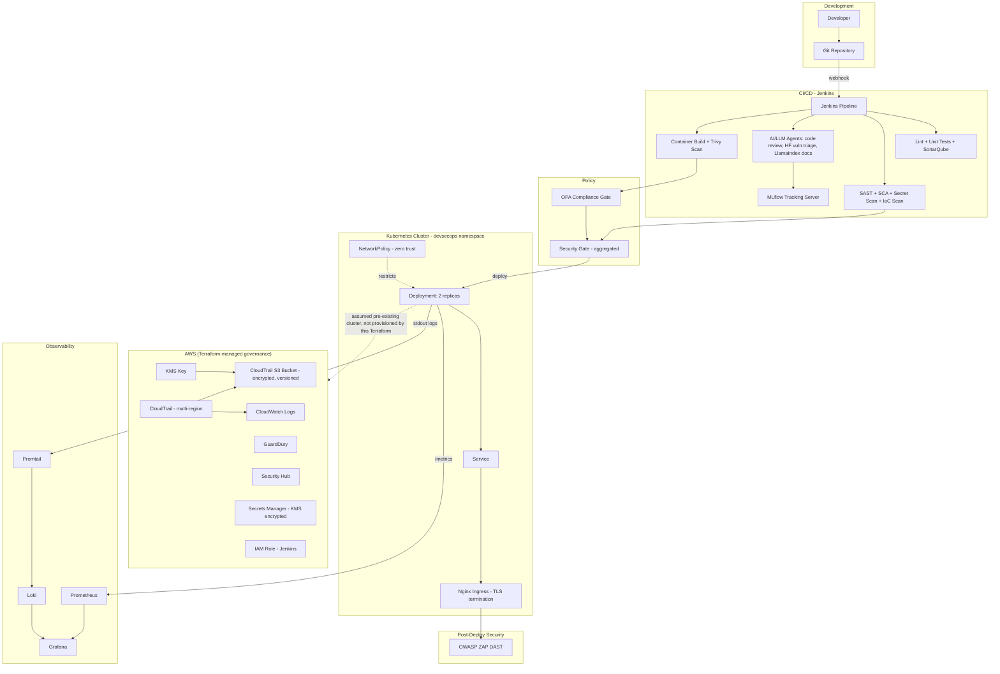
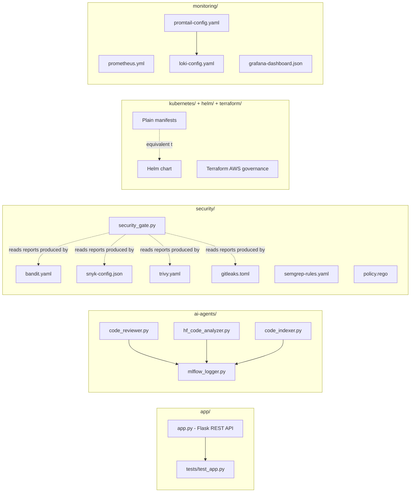

# Architecture

## 1. High-Level Architecture

**Trust boundaries**: the Jenkins pipeline is trusted to run scanners and deploy (it holds no application
secrets beyond what CI tooling itself needs — Snyk/SonarQube tokens, documented in `.env.example`); the
Kubernetes cluster boundary is enforced by NetworkPolicy (only Ingress-controller and monitoring namespaces may
reach the app pod) and by the container securityContext (no privilege escalation, no capabilities, read-only
root filesystem); the AWS account boundary is governed by the Terraform-managed IAM role, KMS key, and
GuardDuty/Security Hub visibility — Terraform does not manage the Kubernetes cluster's own trust boundary
(RBAC), which is an explicitly documented gap (see `docs/SECURITY.md` Section 10).

## 2. Component Architecture

## 3. Application Architecture
See `docs/TRD.md` Section 4. Single Flask process, gunicorn-served, SQLite-backed, stateless except for that
SQLite file.

## 4. CI/CD Architecture
See `docs/TRD.md` Section 11 and `docs/FLOW.md` "CI/CD Flow" for the full stage diagram.

## 5. Security Architecture
See `docs/SECURITY.md` in full.

## 6. Cloud Architecture
Terraform manages AWS-account-level governance (KMS, CloudTrail, GuardDuty, Security Hub, Secrets Manager, an
IAM role) around an assumed pre-existing Kubernetes cluster — see the High-Level Architecture diagram above,
"CLOUD" subgraph, and its dashed relationship to the Kubernetes runtime. This is a deliberate scope boundary
(documented in `docs/GAP_ANALYSIS.md` "Architecture Problems"), not a missing piece silently glossed over.

## 7. LLM Architecture
See `docs/TRD.md` Sections 7–9 and `docs/FLOW.md` "LLM Flow" for the full diagram: three independent,
CI-invoked scripts (code review, vulnerability triage, documentation generation), each with a live path (local
Ollama / Hugging Face Hub) and a static fallback path, all logged to MLflow.

## 8. Deployment Architecture
See `docs/FLOW.md` "Deployment Flow": a built and Trivy-scanned image is deployed either via plain `kubectl
apply` of `kubernetes/*.yaml` or via the equivalent Helm chart, into a dedicated `devsecops` namespace, with
2 replicas behind a ClusterIP Service and an Nginx Ingress doing TLS termination.

## 9. Data Flow
See `docs/FLOW.md` "Application Flow" and "LLM Flow" for request-level and AI-pipeline-level data flow
respectively. At a system level: source code and configuration flow from the developer through Git into
Jenkins; Jenkins produces scan reports (security data) and AI reports (AI-generated outputs) as
`reports/*.json`/`docs/*.md` artifacts; the built container image flows from Jenkins to the Kubernetes cluster;
application logs and metrics flow from running pods to Promtail/Loki and Prometheus respectively, and from
there to Grafana for a human to view.

## 10. Trust Boundaries
Covered inline under "High-Level Architecture" above. The three boundaries that matter most for this project's
threat model (see `docs/SECURITY.md` Section 13) are: (a) anonymous internet → Ingress (TLS termination, no
authentication at the Ingress layer itself — authentication happens at the application layer for writes), (b)
Ingress → application pod (NetworkPolicy-restricted), (c) CI pipeline → AWS/Kubernetes (governed by the
Terraform-managed IAM role and whatever kubeconfig/credentials the real Jenkins agent is given — this
repository does not itself store cluster credentials).

## 11. External Dependencies
Ollama (local, for `code_reviewer.py`/`code_indexer.py`'s live path), the Hugging Face Hub (model downloads,
pinned via `HF_MODEL_REVISION` where set), an MLflow tracking server, a SonarQube server, Snyk's API, a
container registry (referenced as `ayeshaakram786/devsecops-app` — update to your own registry before any real
deployment), an Nginx Ingress controller, and — for the Terraform stack — the AWS API. None of these are
bundled with this repository; `docker-compose.yml` stands up local instances of most of them (SonarQube,
Prometheus, Grafana, MLflow, ZAP, Loki+Promtail, and now the app itself) for local development.
