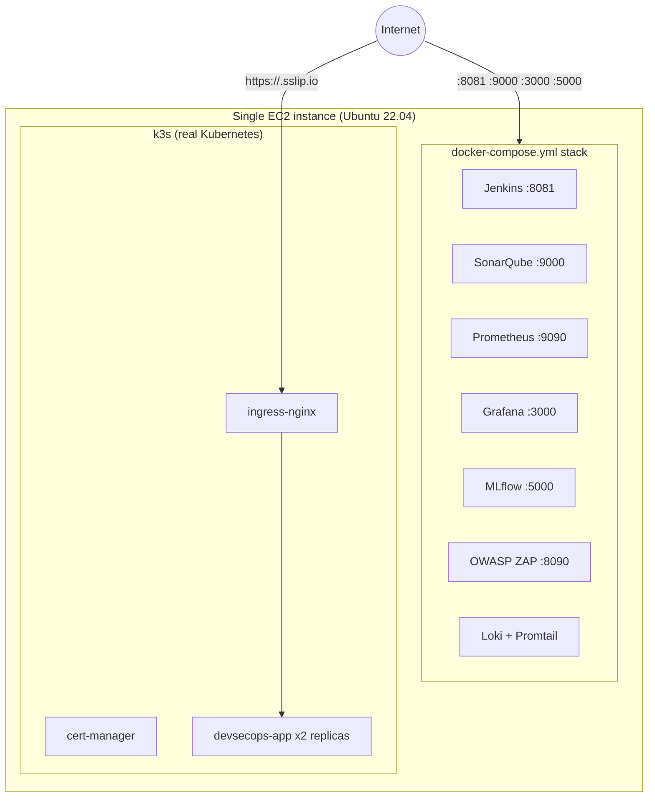

# EC2 Single-Instance Deployment Guide (Budget / Academic Demo)

**Written**: 2026-09-06. **Audience**: the student running this project on their own AWS account for a
university presentation, on a budget of roughly $30–50/month beyond free-tier.

## Why this document exists, and how it differs from `docs/AWS_DEPLOYMENT.md`

`docs/AWS_DEPLOYMENT.md` already in this repo documents a **full Amazon EKS** deployment. Its own cost
section states the honest number: **~$110–150/month** (EKS control plane alone is ~$73/month, before any
EC2 nodes). That does not fit a $30–50/month budget.

This guide instead puts **everything on one EC2 instance**:
- The tool stack (Jenkins, SonarQube, Prometheus, Grafana, Loki, Promtail, MLflow, OWASP ZAP) runs via this
  repo's existing `docker-compose.yml` — it was already built for exactly this.
- The app itself is deployed to a **real Kubernetes cluster** — [k3s](https://k3s.io), a lightweight,
  certified Kubernetes distribution that runs comfortably on a single node — using this repo's actual Helm
  chart (`helm/devsecops-app/`), so the "deploy to Kubernetes" requirement is genuinely satisfied, not faked.
- No EKS control-plane fee, no ECR, no load balancer charges. Estimated cost: **a few dollars a month**, see
  below — because compute is billed by the hour and you stop the instance when not using it.

Keep `docs/AWS_DEPLOYMENT.md` as the "if you ever get a real budget/employer" reference. Use this one to
actually get a working, shareable demo live.

---

## 1. What you'll end up with



**Two independent things run side by side on the same box:**
1. The **tool stack** (docker-compose) — Jenkins runs the pipeline, SonarQube/Prometheus/Grafana/Loki/MLflow/
   ZAP are the dashboards you'll show off.
2. The **actual deployed application** — a separate, real k3s Kubernetes cluster, reachable over HTTPS at a
   public URL, using this repo's own Helm chart with no modification to its templates.

They're independent so that a Jenkins/SonarQube crash doesn't take down the thing your professor is looking
at, and vice versa.

---

## 2. EC2 instance sizing and cost

| Instance | vCPU | RAM | On-demand $/hr (us-east-1, approx) | 24/7 monthly | Verdict |
|---|---|---|---|---|---|
| t3.micro (free tier) | 2 | 1 GiB | free (750 hrs/mo, 12 months) | $0 | **Too small.** Jenkins + SonarQube + k3s alone need more RAM than this has. |
| t3.medium | 2 | 4 GiB | ~$0.0416 | ~$30 | Workable if you stop SonarQube/ZAP when not actively demoing them. |
| **t3.large (recommended)** | 2 | 8 GiB | ~$0.0832 | ~$60 | Comfortably runs everything at once. See note below on why the real cost is much lower. |
| t3.xlarge | 4 | 16 GiB | ~$0.1664 | ~$120 | Overkill for this project. |

**Recommendation: `t3.large`, Ubuntu 22.04 LTS (amd64).**

Prices vary by region — check the [AWS Pricing Calculator](https://calculator.aws/) for your actual region
before committing; ap-south-1 (Mumbai) and us-east-1 (N. Virginia) are both reasonable choices, us-east-1 is
usually a little cheaper.

### Why your real bill will be far under $60/month

EC2 is billed **per second while running**. A t3.large costs money only while it's in the `running` state —
stopping it (not terminating) stops the compute charge entirely. If you:
- Run it ~2–4 hours/day while building this out over a week or two, then
- Start it ~30–60 minutes before your actual presentation and stop it right after,

...your total running time for the whole engagement is likely **20–40 hours**, i.e. **$2–4** in compute. Your
actual costs come from:

| Item | Cost |
|---|---|
| EC2 compute (t3.large, ~30 running hours total) | ~$2.50 |
| EBS storage, 40 GB gp3 (30 GB free tier + 10 GB paid) | ~$0.80/month, prorated |
| Elastic IP, attached to a *running* instance | **$0** |
| Elastic IP, attached to a *stopped* instance | ~$0.005/hr (~$3.60/mo) if left stopped for a long stretch |
| Data transfer out (a few GB for a demo) | ~$0.50 |

**Total: comfortably under $10** for the whole project unless you leave the instance running continuously for
weeks. Your $30–50 budget gives you a large safety margin — see §9 "Cost control" for the stop/start routine.

### Storage
**40 GB gp3** root volume. 30 GB of that is free-tier-eligible on a new account; the extra 10 GB costs about
$0.80/month. 30 GB alone is workable but tight once Docker images, SonarQube's database, and Loki's log
storage accumulate — 40 GB gives headroom.

---

## 3. Part A — Launch the EC2 instance (AWS Console)

1. **EC2 → Launch instance.**
2. **Name**: `devsecops-demo` (anything you like).
3. **AMI**: *Ubuntu Server 22.04 LTS (HVM), SSD Volume Type* — amd64, not arm64 (arm64 also works but every
   command in this guide assumes amd64; don't mix them).
4. **Instance type**: `t3.large` (see §2).
5. **Key pair**: create a new one (e.g. `devsecops-demo-key`), download the `.pem` file, and
   `chmod 400 devsecops-demo-key.pem` on your local machine. You cannot re-download it later.
6. **Network settings → Edit** — create a new security group (`devsecops-demo-sg`) with these inbound rules:

   | Type | Port | Source | Purpose |
   |---|---|---|---|
   | SSH | 22 | **My IP** | your own SSH access only — never `0.0.0.0/0` here |
   | HTTP | 80 | Anywhere (0.0.0.0/0) | Let's Encrypt certificate validation + HTTPS redirect for the app |
   | HTTPS | 443 | Anywhere (0.0.0.0/0) | the public app URL you'll share |
   | Custom TCP | 8081 | Anywhere (0.0.0.0/0) if you'll show Jenkins to others, else My IP | Jenkins UI |
   | Custom TCP | 9000 | Anywhere (0.0.0.0/0) if presenting, else My IP | SonarQube UI |
   | Custom TCP | 3000 | Anywhere (0.0.0.0/0) if presenting, else My IP | Grafana UI |
   | Custom TCP | 5000 | My IP | MLflow UI |
   | Custom TCP | 9090 | My IP | Prometheus UI (optional — mostly for you, not the audience) |

   Opening tool UIs to the world is fine for a short-lived academic demo box; just make sure you set real
   credentials (§4) rather than leaving anything on a default password, and shut the instance down when the
   demo period is over.

7. **Storage**: 40 GiB, gp3.
8. **Launch instance.**
9. **Allocate an Elastic IP** (EC2 → Network & Security → Elastic IPs → Allocate) and **associate it** with
   this instance. This keeps your public IP — and therefore your HTTPS URL (§6) — stable across stop/start.

---

## 4. Part B — First login and bootstrap

```bash
ssh -i devsecops-demo-key.pem ubuntu@<YOUR_ELASTIC_IP>
```

On the instance:

```bash
git clone <your-fork-or-repo-url> DevSecOps-CI-CD-Project
cd DevSecOps-CI-CD-Project
chmod +x scripts/ec2-bootstrap.sh
sudo bash scripts/ec2-bootstrap.sh
```

This runs [scripts/ec2-bootstrap.sh](../scripts/ec2-bootstrap.sh) (new — see that file for exactly what it
does and why). It takes 5–10 minutes and installs Docker, k3s, ingress-nginx, cert-manager, Helm, kubectl, AWS
CLI, and the scanner CLIs (checkov/trivy/gitleaks/opa) this repo's `Jenkinsfile` calls.

After it finishes:

```bash
newgrp docker    # picks up docker group membership without a full logout
kubectl get nodes                 # should show one Ready node
kubectl get pods -A               # ingress-nginx and cert-manager pods should be Running within ~1-2 min
```

---

## 5. Part C — Configure environment variables

```bash
cp .env.example .env
nano .env
```

At minimum, set real values for (see `.env.example` for what each one does):
- `APP_API_KEY` — generate with `openssl rand -hex 32`
- `GRAFANA_ADMIN_USER` / `GRAFANA_ADMIN_PASSWORD` — anything other than the documented-insecure defaults
- Leave `SNYK_TOKEN` / `SONAR_TOKEN` / `HF_MODEL_REVISION` unset if you don't have them — every stage that
  needs them degrades gracefully (see `CONTEXT.md`), it just won't run that specific check/live-model path.

---

## 6. Part D — Bring up the tool stack (Jenkins, SonarQube, Prometheus, Grafana, Loki, MLflow, ZAP)

```bash
docker compose up -d
docker compose ps
```

Give SonarQube 1–2 minutes to initialize (its embedded Elasticsearch is slow to start — this is why the
bootstrap script set `vm.max_map_count`). Then from your own laptop browser:

- Jenkins: `http://<ELASTIC_IP>:8081`
- SonarQube: `http://<ELASTIC_IP>:9000` (default login `admin`/`admin`, you'll be forced to change it)
- Grafana: `http://<ELASTIC_IP>:3000` (login with the `GRAFANA_ADMIN_USER`/`PASSWORD` you set in `.env`)
- MLflow: `http://<ELASTIC_IP>:5000`
- Prometheus: `http://<ELASTIC_IP>:9090`

**Jenkins first-run**: `docker exec jenkins cat /var/jenkins_home/secrets/initialAdminPassword` gives you the
unlock code. Install the suggested plugins, create an admin user, then **New Item → Pipeline**, point it at
your Git repo (or paste the `Jenkinsfile` directly with "Pipeline script"), and run it.

**Grafana's dashboard now appears automatically** — no manual import needed (see CONTEXT.md Change #12);
the "Import the Grafana dashboard" step from earlier versions of this guide is no longer necessary.

**Jenkins's "Deploy to Kubernetes" stage can now do a real deploy** (as of CONTEXT.md Change #12) — but only
if you give it something to push the image to. Set `DOCKERHUB_USERNAME`/`DOCKERHUB_TOKEN` in `.env` (see
`.env.example`) *before* `docker compose up -d` and the stage will push the build's image to Docker Hub and
run the real `helm upgrade --install` against whatever cluster the mounted k3s kubeconfig points at. **Leave
both unset and the stage now says so explicitly** rather than silently applying an unrelated throwaway
manifest the way it used to — you'll see a clear "skipping real deploy" message in the Jenkins console output,
with a pointer back to the manual, no-registry-needed Part E process below. Either way, **doing the manual
Helm deploy in Part E once is still the fastest path** to a live URL if you don't want to set up a Docker Hub
token — it's not a workaround for a limitation, just the simpler of two equally real options.

---

## 7. Part E — Deploy the app to Kubernetes (the real product)

**Build the image and load it straight into k3s — no Docker Hub or ECR needed** for a single-node cluster:

```bash
docker build -t devsecops-app:local -f app/Dockerfile .
docker save devsecops-app:local | sudo k3s ctr images import -
```

**Get your sslip.io hostname.** [sslip.io](https://sslip.io) is a free DNS service that resolves
`<anything>.<your-ip-with-dots>.sslip.io` straight back to that IP — no domain purchase, no DNS records to
manage, and it's a real publicly-resolvable hostname so Let's Encrypt can issue a real certificate for it:

```bash
MY_IP=$(curl -s ifconfig.me)
APP_HOST="devsecops.${MY_IP}.sslip.io"
echo "Your app will be at: https://${APP_HOST}"
```

**Create the Let's Encrypt ClusterIssuer** (one-time; replace the email placeholder with your own — Let's
Encrypt uses it only for certificate-expiry notices):

```bash
cat <<'EOF' | kubectl apply -f -
apiVersion: cert-manager.io/v1
kind: ClusterIssuer
metadata:
  name: letsencrypt-prod
spec:
  acme:
    email: you@example.com
    server: https://acme-v02.api.letsencrypt.org/directory
    privateKeySecretRef:
      name: letsencrypt-prod-key
    solvers:
      - http01:
          ingress:
            class: nginx
EOF
```

**Deploy with Helm**, using this repo's actual chart (`helm/devsecops-app/`) unmodified — every value below
is already a parameter the chart supports:

```bash
helm upgrade --install devsecops-app ./helm/devsecops-app \
    --namespace default \
    --set image.repository=devsecops-app \
    --set image.tag=local \
    --set ingress.hosts[0].host="${APP_HOST}" \
    --set ingress.hosts[0].paths[0].path=/ \
    --set ingress.tls[0].hosts[0]="${APP_HOST}" \
    --set ingress.tls[0].secretName=devsecops-tls
```

**Point the Ingress at the ClusterIssuer** (the chart's Ingress template doesn't expose an `annotations` value,
so this one annotation is added post-install rather than by editing the chart):

```bash
kubectl annotate ingress devsecops-app-ingress -n default \
    cert-manager.io/cluster-issuer=letsencrypt-prod --overwrite
```

**Verify** (cert issuance takes 30–90 seconds):

```bash
kubectl get pods -n default                       # 2 devsecops-app pods, Running
kubectl get certificate -n default -w              # wait for READY=True, then Ctrl-C
curl -s https://${APP_HOST}/health                 # {"status": "healthy"}
```

Open `https://<APP_HOST>` in a browser from **any machine, anywhere** — this is the link you share.

---

## 8. Part F — What the end viewer will actually see

**Share `https://<APP_HOST>/dashboard`, not the bare `https://<APP_HOST>/`.** The bare root is still a
backend REST endpoint — it returns raw JSON (`{"message": "AI DevSecOps Pipeline - Sample App", ...}`), which
is correct behavior for an API but not something to put on a screen in front of a class. `/dashboard` (added
2026-09-06, `app/templates/dashboard.html`, served by a new route in `app/app.py`) is a proper landing page:
a live health badge (polls `/health` for real), an interactive panel to search/list/add users against the
actual running API without typing curl commands, and a card grid linking out to Jenkins/SonarQube/Grafana/
MLflow on this same host (built automatically from the page's own hostname — nothing to configure).

For a presentation, still build the walkthrough around a short tour, now starting from that one link:

1. **`/dashboard`** — the live health badge and the interactive user search/list/add demo. Proves the app is
   really running on Kubernetes and reachable over real HTTPS, not `localhost`. `kubectl get pods -n default`
   alongside it shows 2 replicas actually running. The "Add user" demo needs the real `APP_API_KEY` typed into
   its password field live — it's never embedded in the page itself.
2. **Jenkins** (`http://<ELASTIC_IP>:8081`, also linked from the dashboard) — the pipeline run, stage-by-stage,
   green checkmarks, archived `reports/*` artifacts (Bandit/Semgrep/Trivy/checkov JSON, ZAP results).
3. **SonarQube** (`http://<ELASTIC_IP>:9000`) — code quality dashboard, a concrete, visual quality gate.
4. **Grafana** (`http://<ELASTIC_IP>:3000`) — the imported dashboard: live HTTP request-rate graph and the
   "Application Security Logs" panel backed by real Loki log lines shipped from the running containers.
5. **MLflow** (`http://<ELASTIC_IP>:5000`) — the three AI/LLM pipeline runs (code review, HF vulnerability
   triage, doc generation) logged as tracked experiments, with their fallback-vs-live status visible.

The dashboard's card grid links to 2–4 for you, so `/dashboard` alone is close to a one-link demo; the numbered
list above is really about knowing what to narrate once you're on each page.

---

## 9. Cost control — the stop/start routine

**Stop the instance whenever you're not actively working on it or presenting** (EC2 console → Instance state
→ Stop instance, or `aws ec2 stop-instances --instance-ids <id>`). This halts compute billing immediately.
Storage (EBS) keeps billing at its small flat rate regardless of stop/start.

- With the Elastic IP still associated, a **stopped** instance costs ~$0.005/hr for the IP (~$3.60/month if
  left stopped for a full month) — trivial, and it means your sslip.io URL and TLS certificate stay valid
  without any changes when you start the instance back up.
- Before your presentation: start the instance, wait ~1 minute for Docker/k3s services to come back up
  (`docker compose ps` and `kubectl get pods -A` to confirm), then present.
- After: stop it again.
- If you want to eliminate even the small EIP charge between long gaps (e.g. over a semester break), release
  the Elastic IP — but then your next `start` gets a **new** public IP, meaning a new sslip.io hostname and a
  fresh certificate request. Only do this if you don't mind re-running the last two commands in Part E.

---

## 10. Teardown (when the project is fully done)

```bash
helm uninstall devsecops-app -n default
docker compose down -v          # -v also removes SonarQube/Grafana/Prometheus/MLflow/Loki volumes
```
Then in the AWS Console: **Terminate** the instance (not just stop), **release** the Elastic IP, and delete the
security group. Terminating deletes the EBS volume too (unless you unchecked "delete on termination" at
launch) — this is the point of no return, confirm you don't need anything on it first.

---

## 11. Troubleshooting

| Symptom | Cause / fix |
|---|---|
| SonarQube container keeps restarting | `vm.max_map_count` not applied — re-run `sudo sysctl -w vm.max_map_count=262144` and `docker compose restart sonarqube`. |
| `helm upgrade --install` hangs on the Ingress | `ingress-nginx` pod not yet `Running` — check `kubectl get pods -n ingress-nginx`. |
| Certificate stuck `READY=False` | Port 80 not reachable from the internet (check the security group) — Let's Encrypt's HTTP-01 challenge needs it. `kubectl describe certificate devsecops-tls -n default` shows the exact reason. |
| One pod shows `ImagePullBackOff` named `devsecops-app-good` in `default` namespace | Jenkins's Deploy stage fell back to the OPA-policy demo manifest (no `DOCKERHUB_USERNAME`/`TOKEN` set, or no reachable cluster) — harmless, unrelated to your real Helm release; see §6. |
| Jenkins image fails to build (`docker compose up` errors during the jenkins step) | A pinned tool version in `jenkins/Dockerfile` may have been yanked from PyPI/GitHub since this was written (2026-09-06) — check the build log for which `RUN` step failed and bump that one pin. |
| Out of memory / OOM-killed containers | Confirm the 4G swapfile is active (`swapon --show`); temporarily `docker compose stop sonarqube zap` when not demoing them — they're the two heaviest tool-stack containers. |
| `kubectl` egress/DNS oddities from inside the app pod | The Helm chart's `NetworkPolicy` template only opens **TCP** port 53 in egress (the plain `kubernetes/network-policy.yaml` opens UDP too) — the app doesn't make outbound calls at runtime, so this normally doesn't matter, but it's a known gap if you ever add one. |
| NetworkPolicy seems to have no effect at all | k3s's default CNI (Flannel) **does not enforce NetworkPolicy**. The policy still documents and demonstrates the intended zero-trust design (a legitimate thing to point out in Q&A), but nothing will actually be blocked in this specific single-node setup unless you additionally install a policy-enforcing CNI like Calico — out of scope for this budget/timeline. |

---

## Appendix — what changed in `jenkins/Dockerfile` and why

Everything the earlier version of this appendix proposed as optional future work is now done — see
`jenkins/Dockerfile` and CONTEXT.md Change #12. In short: `docker-compose.yml`'s `jenkins` service now
**builds** a custom image instead of running the stock `jenkins/jenkins:lts` one, because that stock image
has none of python3, the Docker CLI, kubectl, Helm, or the bandit/semgrep/checkov/gitleaks/opa binaries the
root `Jenkinsfile`'s stages actually call — nearly every stage past "Checkout Code" would otherwise fail with
"command not found" the first time the pipeline actually ran. If you rebuild this image later, remember its
tool versions are deliberately pinned (same reasoning as `ai-agents/requirements.txt`) — bump them on purpose,
check `docs/EC2_DEPLOYMENT_GUIDE.md`'s troubleshooting table above if a pin has since been yanked upstream.
