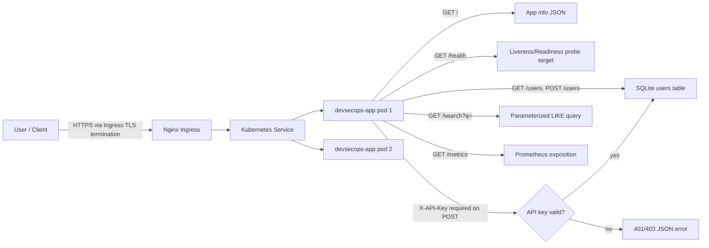
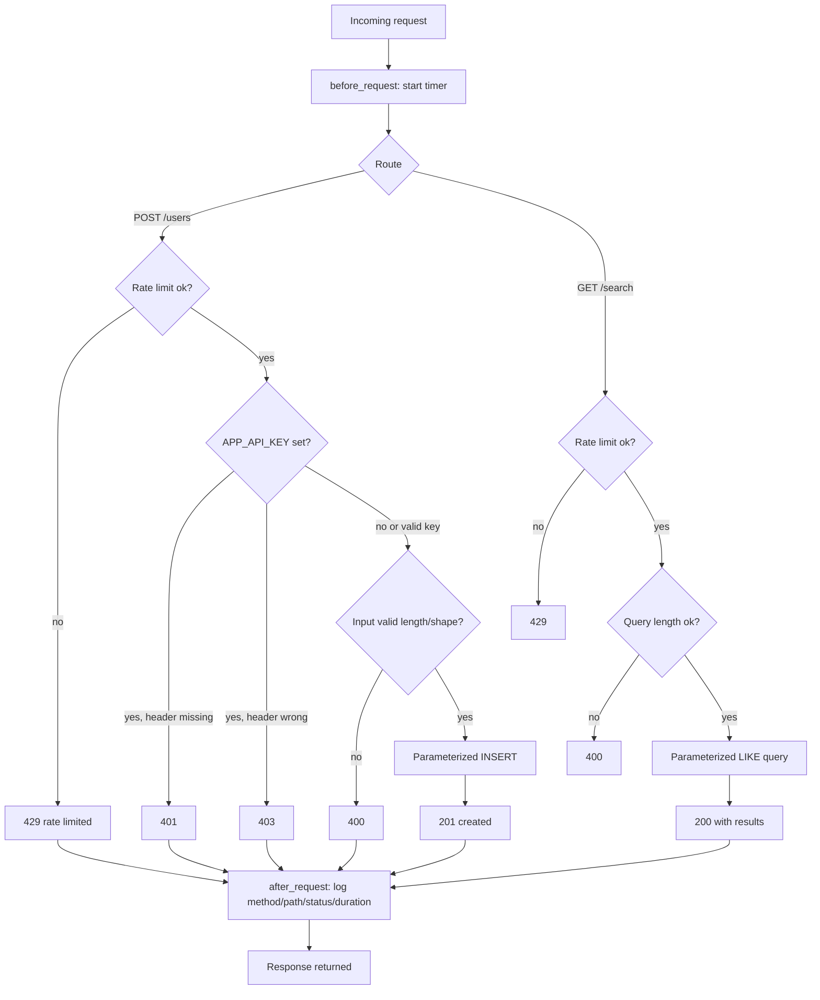
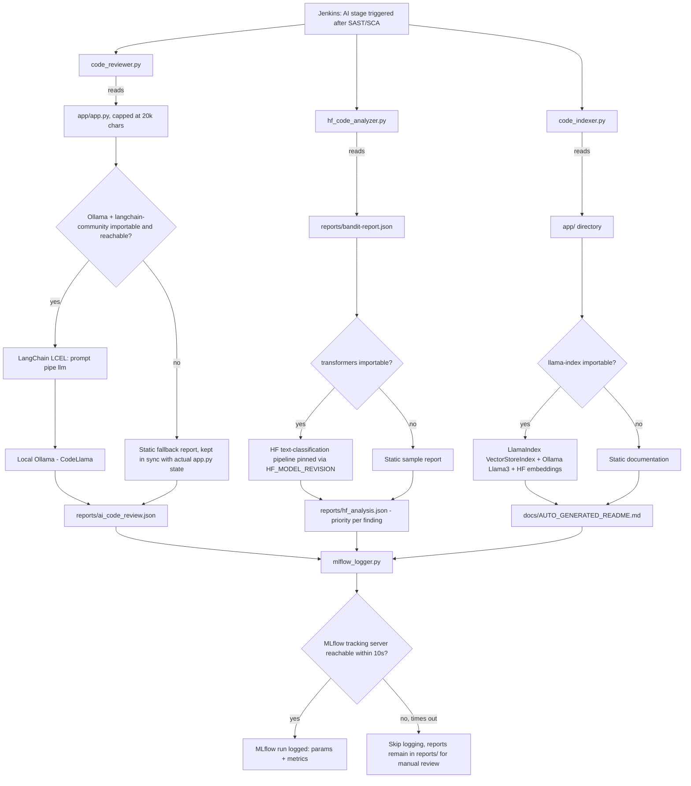
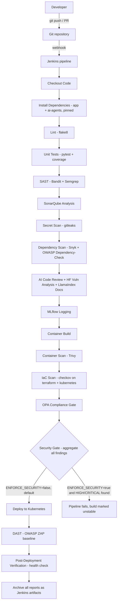
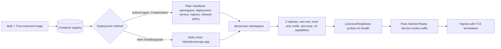
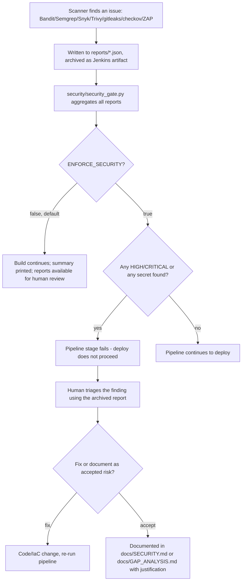

# System Flow

Diagrams reflect the actual implemented flow in this repository, not the aspirational version from the
presentation slides — see `docs/SECURITY.md` for exactly where those diverge (TLS 1.3 / OAuth2 / JWT / mTLS).

## User Flow

## Application Flow (request handling)

## LLM Flow

## CI/CD Flow

## Deployment Flow

## Incident Flow (what happens when a security issue is detected)

